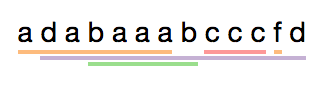

# ipymarkup [](https://travis-ci.org/natasha/ipymarkup)

NER markup visualisation for Jupyter Notebook. 


# Install

`ipymarkup` supports both Python 2.7+ / 3.3+.

```bash
$ pip install ipymarkup
```

# Usage

```python
from ipymarkup import Span, LineMarkup

text = 'a d a b a a a b c c c f d'
spans = [
    Span(0, 13, 'a'),
    Span(2, 25, 'd'),
    Span(6, 15, 'b'),
    Span(16, 21, 'c'),
    Span(22, 23, 'f'),
]
LineMarkup(text, spans)

```


```python
from ipymarkup import AsciiMarkup

AsciiMarkup(text, spans)

```
```
a d a b a a a b c c c f d
a------------   c---- f  
  d----------------------
      b--------          
```


For more examples and explanation see [ipymarkup documentation](http://nbviewer.jupyter.org/github/natasha/ipymarkup/blob/master/docs.ipynb).

# License

Source code of `ipymarkup` is distributed under MIT license (allows modification and commercial usage)

# Support

- Chat — https://telegram.me/natural_language_processing
- Issues — https://github.com/natasha/ipymarkup/issues
