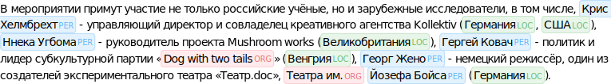
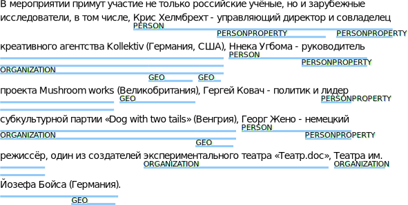

[](https://travis-ci.org/natasha/ipymarkup) [](https://coveralls.io/github/natasha/ipymarkup?branch=master)

NER markup visualization for Jupyter Notebook. 


## Install

`ipymarkup` supports both Python 2.7+ / 3.4+, non Jupyter functionality should work on 2.7+ / 3.3+, PyPy.

```bash
$ pip install ipymarkup
```

## Usage

```python
from ipymarkup import show_ascii_markup

text = 'В мероприятии примут участие не только российские учёные, но и зарубежные исследователи, в том числе, Крис Хелмбрехт - управляющий директор и совладелец креативного агентства Kollektiv (Германия, США), Ннека Угбома - руководитель проекта Mushroom works (Великобритания), Гергей Ковач - политик и лидер субкультурной партии «Dog with two tails» (Венгрия), Георг Жено - немецкий режиссёр, один из создателей экспериментального театра «Театр.doc», Театра им. Йозефа Бойса (Германия).'
spans = [(102, 116, 'PER'), (186, 194, 'LOC'), (196, 199, 'LOC'), (202, 214, 'PER'), (254, 268, 'LOC'), (271, 283, 'PER'), (324, 342, 'ORG'), (345, 352, 'LOC'), (355, 365, 'PER'), (445, 455, 'ORG'), (456, 468, 'PER'), (470, 478, 'LOC')]
show_ascii_markup(text, spans)
```


Same visualization in color:
```python
from ipymarkup import show_box_markup
from ipymarkup.palette import palette, BLUE, RED, GREEN

show_box_markup(text, spans, palette=palette(PER=BLUE, ORG=RED, LOC=GREEN))
```


In case spans overlap:
```python
from ipymarkup import show_line_markup

spans = [(102, 200, 'PERSON'), (119, 139, 'PERSONPROPERTY'), (142, 200, 'PERSONPROPERTY'), (153, 200, 'ORGANIZATION'), (186, 194, 'GEO'), (196, 199, 'GEO'), (202, 252, 'PERSON'), (217, 252, 'PERSONPROPERTY'), (254, 268, 'GEO'), (296, 353, 'PERSONPROPERTY'), (302, 353, 'ORGANIZATION'), (345, 352, 'GEO'), (355, 385, 'PERSON'), (368, 385, 'PERSONPROPERTY'), (406, 443, 'ORGANIZATION'), (445, 479, 'ORGANIZATION'), (470, 478, 'GEO')]
show_line_markup(text, spans, palette=palette(BLUE))
```


For more examples and explanation see [ipymarkup documentation](http://nbviewer.jupyter.org/github/natasha/ipymarkup/blob/master/docs.ipynb).

## License

The source code of `ipymarkup` is distributed under MIT license (allows modification and commercial usage)

## Support

- Chat — https://telegram.me/natural_language_processing
- Issues — https://github.com/natasha/ipymarkup/issues

## Development

Tests:

```bash
make test
```

Package:

```bash
make version
git push
git push --tags

make clean wheel upload
```
