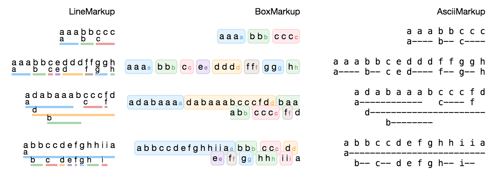
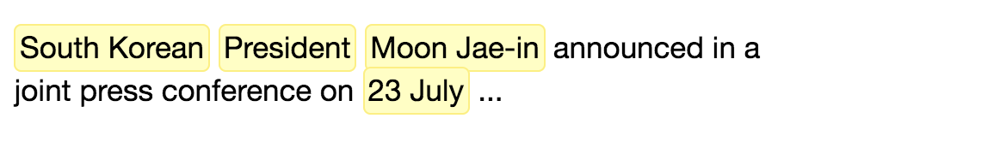

# ipymarkup [](https://travis-ci.org/natasha/ipymarkup) [](https://coveralls.io/github/natasha/ipymarkup?branch=master)

NER markup visualization for Jupyter Notebook. 


## Install

`ipymarkup` supports both Python 2.7+ / 3.4+, non Jupyter functionality should work on 2.7+ / 3.3+, PyPy.

```bash
$ pip install ipymarkup
```

## Usage

Display simple nonoverlapping spans in Jupyter:
```python
from ipymarkup import show_markup

text = 'South Korean President Moon Jae-in announced in a joint press conference on 23 July ...'
spans = [
    (0, 12),
    (13, 22),
    (23, 34),
    (76, 83)
]

show_markup(text, spans)

```
> 

Add labels:
```python
spans = [
    (0, 12, 'GEO'),
    (13, 22, 'POSITION'),
    (23, 34, 'NAME'),
    (76, 83, 'DATE')
]

show_markup(text, spans)
```
> 

There is a number of visualizations (see [docs](http://nbviewer.jupyter.org/github/natasha/ipymarkup/blob/master/docs.ipynb#Visualizations) for full list). By default, `BoxLabelMarkup` is used. In case spans overlap (`PERSON` overlaps `NAME`), switch to `LineMarkup`:
```python
from ipymarkup import LineMarkup

spans = [
    (0, 12, 'GEO'),
    (13, 22, 'POSITION'),
    (23, 34, 'NAME'),
    (0, 34, 'PERSON'),
    (76, 83, 'DATE')
]

show_markup(text, spans, LineMarkup)
```
> 

Finally to use `ipymarkup` outside of Jupyter, use `AsciiMarkup`:
```python
from ipymarkup import markup, AsciiMarkup

for line in markup(text, spans, AsciiMarkup).as_ascii:
    print(line)
```
```
South Korean President Moon Jae-in announced in a joint press 
GEO--------- POSITION- NAME-------                            
PERSON----------------------------                            
conference on 23 July ...
              DATE---    
```

For more examples and explanation see [ipymarkup documentation](http://nbviewer.jupyter.org/github/natasha/ipymarkup/blob/master/docs.ipynb).

## License

The source code of `ipymarkup` is distributed under MIT license (allows modification and commercial usage)

## Support

- Chat — https://telegram.me/natural_language_processing
- Issues — https://github.com/natasha/ipymarkup/issues
