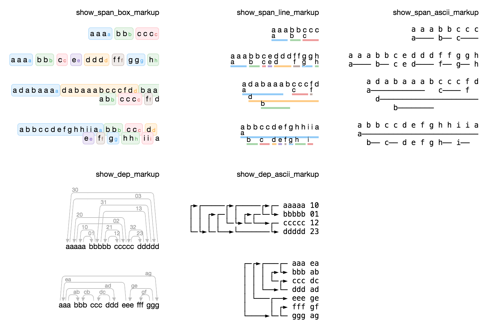

 [](https://codecov.io/gh/natasha/ipymarkup)

Collection of NLP visualizations for NER and syntax tree markup. Similar to Spacy <a href="https://explosion.ai/demos/displacy">displaCy</a> and <a href="https://explosion.ai/demos/displacy-ent">displaCy ENT</a>.



## Install

`ipymarkup` supports Python 3.5+.

```bash
$ pip install ipymarkup
```

## Usage

```python
>>> from ipymarkup import show_ner_ascii_markup, show_dep_ascii_markup

>>> text = 'В мероприятии примут участие не только российские учёные, но и зарубежные исследователи, в том числе, Крис Хелмбрехт - управляющий директор и совладелец креативного агентства Kollektiv (Германия, США), Ннека Угбома - руководитель проекта Mushroom works (Великобритания), Гергей Ковач - политик и лидер субкультурной партии «Dog with two tails» (Венгрия), Георг Жено - немецкий режиссёр, один из создателей экспериментального театра «Театр.doc», Театра им. Йозефа Бойса (Германия).'
>>> spans = [(102, 116, 'PER'), (186, 194, 'LOC'), (196, 199, 'LOC'), (202, 214, 'PER'), (254, 268, 'LOC'), (271, 283, 'PER'), (324, 342, 'ORG'), (345, 352, 'LOC'), (355, 365, 'PER'), (445, 455, 'ORG'), (456, 468, 'PER'), (470, 478, 'LOC')]
>>> show_ascii_markup(text, spans)

В мероприятии примут участие не только российские учёные, но и 
зарубежные исследователи, в том числе, Крис Хелмбрехт - управляющий 
                                       PER───────────               
директор и совладелец креативного агентства Kollektiv (Германия, США),
                                                       LOC─────  LOC  
 Ннека Угбома - руководитель проекта Mushroom works (Великобритания), 
 PER─────────                                        LOC───────────   
Гергей Ковач - политик и лидер субкультурной партии «Dog with two 
PER─────────                                         ORG──────────
tails» (Венгрия), Георг Жено - немецкий режиссёр, один из создателей 
─────   LOC────   PER───────                                         
экспериментального театра «Театр.doc», Театра им. Йозефа Бойса 
                                       ORG─────── PER───────── 
(Германия).
 LOC─────  

>>> words = ['В', 'советский', 'период', 'времени', 'число', 'ИТ', '-', 'специалистов', 'в', 'Армении', 'составляло', 'около', 'десяти', 'тысяч', '.']
>>> deps = [(2, 0, 'case'), (2, 1, 'amod'), (10, 2, 'obl'), (2, 3, 'nmod'), (10, 4, 'obj'), (7, 5, 'compound'), (5, 6, 'punct'), (4, 7, 'nmod'), (9, 8, 'case'), (4, 9, 'nmod'), (13, 11, 'case'), (13, 12, 'nummod'), (10, 13, 'nsubj'), (10, 14, 'punct')]
>>> show_dep_ascii_markup(words, deps)

        ┌──► В            case
        │ ┌► советский    amod
┌──────►└─└─ период       obl
│       └──► времени      nmod
│ ┌►┌─┌───── число        obj
│ │ │ │ ┌►┌─ ИТ           compound
│ │ │ │ │ └► -            punct
│ │ │ └►└─── специалистов nmod
│ │ │     ┌► в            case
│ │ └────►└─ Армении      nmod
└─└─┌─┌───── составляло   
    │ │ ┌──► около        case
    │ │ │ ┌► десяти       nummod
    │ └►└─└─ тысяч        nsubj
    └──────► .            punct

```

For more examples and explanation see [ipymarkup documentation](http://nbviewer.jupyter.org/github/natasha/ipymarkup/blob/master/docs.ipynb).

## Support

- Chat — https://telegram.me/natural_language_processing
- Issues — https://github.com/natasha/ipymarkup/issues

## Development

Tests:

```bash
make test
```

Package:

```bash
make version
git push
git push --tags

make clean package publish
```
